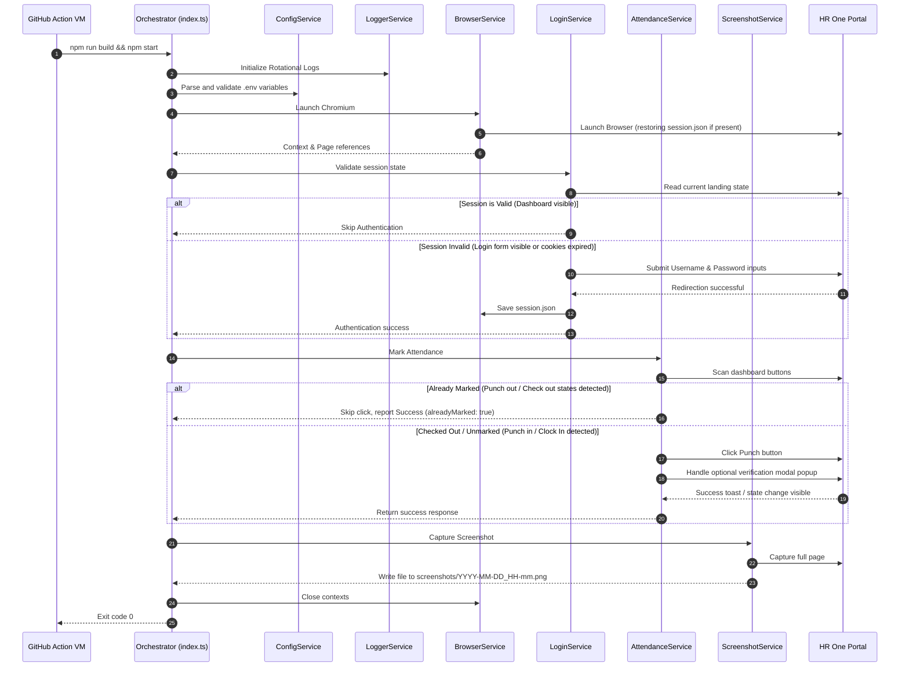

# Attendance Bot

A production-grade, highly modular, automated bot written in TypeScript and Node.js using Playwright. It automatically marks attendance on the HR One employee portal every weekday at 10:00 AM IST using GitHub Actions.

---

## Key Features

- **Automated Cron Execution**: Operates via GitHub Actions every Monday through Friday at 10:00 AM IST (4:30 AM UTC).
- **Session Management**: Automatically saves and restores authentication state (`session.json`), bypassing login forms on subsequent runs and executing re-login flows only if sessions expire.
- **Fail-safe Retry Policies**: Built-in exponential backoff retry wrapper for all crucial browser steps (navigation, inputs, button clicks) to prevent network hiccups from causing job failures.
- **Full-page Screenshot Proofs**: Captures visual verification images of the dashboard state and logs them inside a dedicated `screenshots/` directory for historical tracking.
- **Rotational Log Management**: Implements Daily Rotate Winston File logging alongside stdout terminal stream prints.
- **GitHub Workflow Caching**: Employs GitHub actions cache storage to persist the `session.json` state securely across serverless runner environments.

---

## Project Structure

This project follows a clean architectural layout:

```text
├── .github/
│   └── workflows/
│       └── attendance.yml       # GitHub Actions cron scheduler & runner setup
├── src/
│   ├── config/
│   │   └── index.ts             # Dotenv parser and config validation schema
│   ├── logger/
│   │   └── index.ts             # Winston console and daily file logger
│   ├── browser/
│   │   └── index.ts             # Playwright browser startup and cleanup service
│   ├── login/
│   │   └── index.ts             # Page auth detector and login form runner
│   ├── attendance/
│   │   └── index.ts             # Dashboard scanner and punch-in service
│   ├── screenshot/
│   │   └── index.ts             # Date-formatted full page screenshot capture
│   ├── retry/
│   │   └── index.ts             # Exponential backoff retry helper function
│   ├── utils/
│   │   └── errors.ts            # Custom domain exception classes
│   ├── types/
│   │   └── index.ts             # Service contracts and type definitions
│   └── index.ts                 # Main execution orchestrator
├── tests/
│   ├── config.test.ts           # Configuration validation tests
│   ├── errors.test.ts           # Domain exceptions coverage
│   └── retry.test.ts            # Exponential backoff timing test assertions
├── jest.config.js               # Jest configuration
├── tsconfig.json                # Project TypeScript compiler rules
├── tsconfig.build.json          # Production compiler scope excluding tests
├── .eslintrc.json               # Code style linter checks
├── .prettierrc                  # Formatter guidelines
└── README.md                    # Documentation
```

---

## Architectural Workflow

Below is the execution sequence for the bot:



---

## Configuration (`.env`)

Create a `.env` file at the root of the project:

```env
HRONE_URL=https://yourcompany.hrone.cloud/
USERNAME=your_username_or_email
PASSWORD=your_secure_password
HEADLESS=true
TIMEZONE=Asia/Kolkata
LOG_LEVEL=info
```

### Environment Variables Key

| Variable Name | Required | Default Value  | Description                                                  |
| :------------ | :------- | :------------- | :----------------------------------------------------------- |
| `HRONE_URL`   | **Yes**  | —              | Absolute base URL of your HR One tenant login page.          |
| `USERNAME`    | **Yes**  | —              | Login identifier (email address or username).                |
| `PASSWORD`    | **Yes**  | —              | Auth password credentials.                                   |
| `HEADLESS`    | No       | `true`         | Runs browser without a GUI. Change to `false` for debugging. |
| `TIMEZONE`    | No       | `Asia/Kolkata` | Standard timezone ID used by Playwright schedules.           |
| `LOG_LEVEL`   | No       | `info`         | Filter log print limits (`error`, `warn`, `info`, `debug`).  |

---

## Installation & Setup

### Prerequisites

- Node.js LTS (v18 or higher)
- npm package manager

### 1. Install Dependencies

Clone this repository to your target directory and execute:

```bash
npm install
```

### 2. Install Playwright Browsers

Download the Chromium engine required for automation:

```bash
npm run playwright:install
```

### 3. Run Locally

To test the bot workflow in interactive mode (running the browser visually to verify execution):

1. Set `HEADLESS=false` in `.env`.
2. Run the development starter script:
   ```bash
   npm run dev
   ```

### 4. Build & Production Run

Compile the TypeScript source code and execute the build bundle:

```bash
npm run build
npm start
```

### 5. Running Tests

Execute Jest unit test suites to confirm class architectures:

```bash
npm test
```

---

## Custom Error Handlers

This bot avoids generic JavaScript error handling. Instead, specific actions throw and log custom domain errors extending a base `AttendanceBotError`:

1. `ConfigurationError`: Fired if required credentials or URLs are missing from `.env` inputs.
2. `BrowserLaunchError`: Occurs if Playwright fails to initialize or spin up browser engines.
3. `LoginFailedError`: Triggered if login credentials fail or a redirect to dashboard does not occur.
4. `AttendanceButtonNotFound`: Raised when no punch buttons or widgets match text targets on the page.
5. `AttendanceAlreadyMarked`: Fired if punch out indicators are active indicating verification completion.
6. `SessionExpired`: Returned if state restoration fails and navigation is blocked.
7. `ScreenshotFailed`: Raised if storage issues block writing proof images.

---

## Retry & Backoff Strategy

Flaky web connections often disrupt automation. The bot utilizes a safe wrapper function `retryOperation` which executes key Playwright operations up to **3 times** using a progression delay of:

- **Attempt 1 fail**: wait `2000ms` (2 seconds)
- **Attempt 2 fail**: wait `4000ms` (4 seconds)
- **Attempt 3 fail**: wait `8000ms` (8 seconds)

Permanent failures will raise descriptive errors and prompt an automated visual screenshot capturing what is currently displayed on screen for diagnosis.

---

## GitHub Actions Deployment

To deploy this in the cloud using GitHub Actions:

1. Push this repository to a private GitHub repository.
2. Under your repository settings, navigate to **Settings > Secrets and Variables > Actions**.
3. Create the following repository secrets under **New repository secret**:
   - `HRONE_URL`
   - `USERNAME`
   - `PASSWORD`
4. The workflow will run automatically at 10:00 AM IST (Monday to Friday).
5. You can trigger it manually anytime by opening the **Actions** tab in GitHub, clicking **HR One Attendance Bot**, and selecting **Run workflow**.
6. Each run will generate two downloadable artifacts:
   - `attendance-screenshots`: Verification images.
   - `attendance-logs`: Detailed rotational execution logs.

---

## Future Improvements

1. **Holiday Calendar Integration**: Integrate the bot with public holiday calendars or HR API endpoints to automatically bypass execution on public holidays.
2. **Notification Hooks**: Implement webhook messengers (Slack, Discord, Telegram, or email notification updates) to dispatch alerts if the bot succeeds or runs into failures.
3. **Multi-account Support**: Extend configuration structures to loop through multiple login criteria for couples or co-workers.
